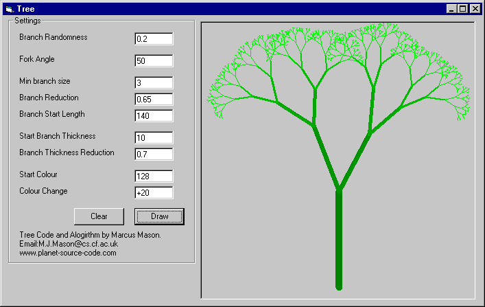



## Graphical Colour Tree Algorithm

### Description

Creates a coloured graphical tree based on a simple algorithm, packed with various options you can change.
 
### More Info
 

             |
---                |---
**Submitted On**   |2000-10-10 11:50:48
**By**             |[Marcus Mason](https://github.com/Planet-Source-Code/PSCIndex/blob/master/ByAuthor/marcus-mason.md)
**Level**          |Intermediate
**User Rating**    |4.7 (28 globes from 6 users)
**Compatibility**  |VB 4\.0 \(16\-bit\), VB 4\.0 \(32\-bit\), VB 5\.0, VB 6\.0, VB Script
**Category**       |[Graphics](https://github.com/Planet-Source-Code/PSCIndex/blob/master/ByCategory/graphics__1-46.md)
**World**          |[Visual Basic](https://github.com/Planet-Source-Code/PSCIndex/blob/master/ByWorld/visual-basic.md)
**Archive File**   |[CODE\_UPLOAD1056010102000\.zip](https://github.com/Planet-Source-Code/marcus-mason-graphical-colour-tree-algorithm__1-11977/archive/master.zip)

